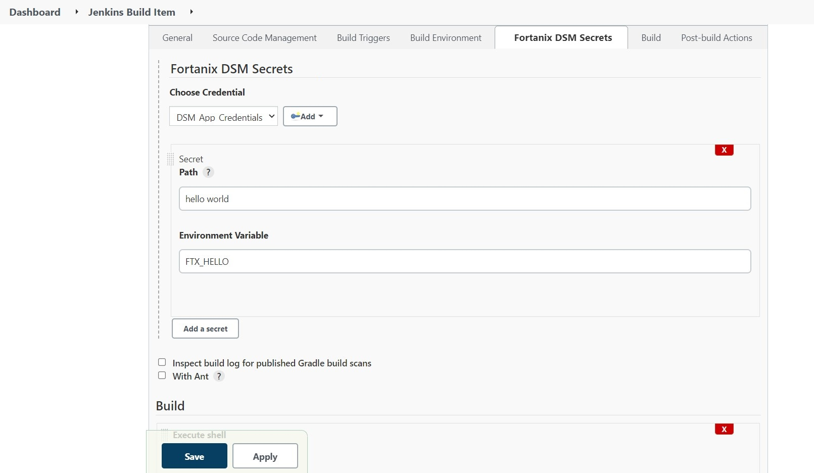
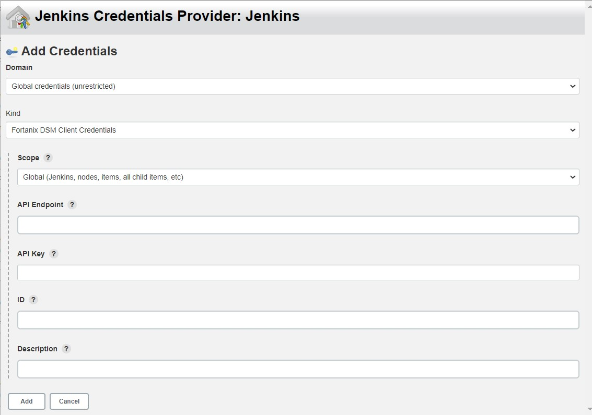

# Fortanix Data Security Manager Secrets for Jenkins CI-CD

This Jenkins Plugin allows you to access and retrieve secrets (and keys) 
from Fortanix Data Security Manager for use in build environments.

## Usage

This plugin requires configuration of credentials at a global or folder level.
The build can then be configured to reference Fortanix DSM endpoint and a path
or label (name) of a secret (or exportable key).

This configuration specifies the `API Endpoint` of Fortanix DSM 
server (or service) containing those secrets.

Additionally you will need to include a valid credential provider.

This credential can be specified at either the global, or project level. Separate
Fortanix DSM Apps can be mapped through the `API Key` to maintain role-based access
controls (RBAC) for projects authorized to access those secrets.

## Release notes

### 1.0

- Initial release tested with Fortanix DSM 4.3.2018

# Contributing

We gratefully accept bug reports and contributions from the community.
By participating in this community, you agree to abide by [Code of Conduct](./CODE_OF_CONDUCT.md).
All contributions are covered under the Developer's Certificate of Origin (DCO).

## Developer's Certificate of Origin 1.1

By making a contribution to this project, I certify that:

(a) The contribution was created in whole or in part by me and I
have the right to submit it under the open source license
indicated in the file; or

(b) The contribution is based upon previous work that, to the best
of my knowledge, is covered under an appropriate open source
license and I have the right under that license to submit that
work with modifications, whether created in whole or in part
by me, under the same open source license (unless I am
permitted to submit under a different license), as indicated
in the file; or

(c) The contribution was provided directly to me by some other
person who certified (a), (b) or (c) and I have not modified
it.

(d) I understand and agree that this project and the contribution
are public and that a record of the contribution (including all
personal information I submit with it, including my sign-off) is
maintained indefinitely and may be redistributed consistent with
this project or the open source license(s) involved.

# License

This project is primarily distributed under the terms of the
Mozilla Public License (MPL) 2.0, see [LICENSE](./LICENSE) for details.
